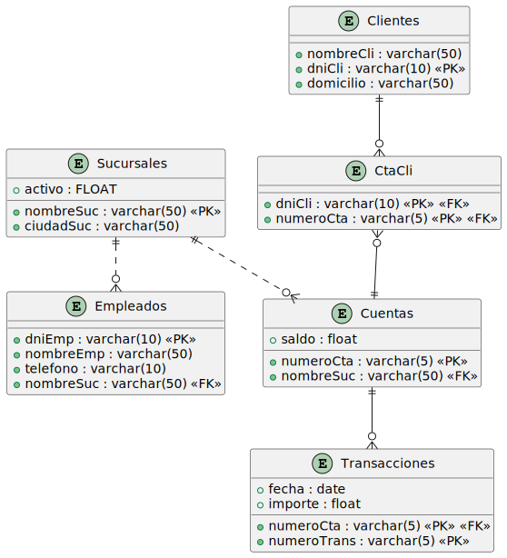

= Consultas de ejemplo básicas para practicar SQL
Bases de datos. Universidad de Almería
:doctype: article
:encoding: utf-8
:lang: en
:toc: left
:numbered:

== Caso de uso Banco

=== Modelo de datos

=== Datos de ejemplo

*Sucursales*

[format="csv",options="header"]
|===================================================
include::banco/Sucursales.csv[]
|===================================================

*Empleados*

[format="csv",options="header"]
|===================================================
include::banco/Empleados.csv[]
|===================================================

*Clientes*

[format="csv",options="header"]
|===================================================
include::banco/Clientes.csv[]
|===================================================

*Cuentas*

[format="csv",options="header"]
|===================================================
include::banco/Cuentas.csv[]
|===================================================

*CtaCli*

[format="csv",options="header"]
|===================================================
include::banco/CtaCli.csv[]
|===================================================

*Transacciones*

[format="csv",options="header"]
|===================================================
include::banco/Transacciones.csv[]
|===================================================

=== Creación de tablas

.Crear las tablas del esquema del banco
====
[source, sql]
include::banco/banco-schema.sql[]
====

=== Consultas básicas

.Mostrar todas las sucursales
====
[source, sql]
include::banco/MostrarTodasSucursales.sql[]
====

[format="csv",options="header"]
|===================================================
include::banco/MostrarTodasSucursales.csv[]
|===================================================

.Mostrar las sucursales de la ciudad _Horseneck_ 
====
[source, sql]
include::banco/MostrarSucursalesHorseneck.sql[]
====

[format="csv",options="header"]
|===================================================
include::banco/MostrarSucursalesHorseneck.csv[]
|===================================================

.Mostrar todos los nombres de las sucursales
====
[source, sql]
include::banco/MostrarNombresSucursales.sql[]
====

[format="csv",options="header"]
|===================================================
include::banco/MostrarNombresSucursales.csv[]
|===================================================

.Mostrar todas las sucursales diferentes en las que haya empleados trabajando
====
[source, sql]
include::banco/MostrarSucursalesEmpleados.sql[]
====

[format="csv",options="header"]
|===================================================
include::banco/MostrarSucursalesEmpleados.csv[]
|===================================================

.Mostrar los datos de las cuentas con las columnas actuales y una nueva columna denominada _saldoEnDolares_ que sea el saldo de la cuenta en dólares
====
[source, sql]
include::banco/SaldoEnDolares.sql[]
====

[format="csv",options="header"]
|===================================================
include::banco/SaldoEnDolares.csv[]
|===================================================

.Mostrar los nombres de la sucursales y sus activos de las sucursales de la ciudad _Horseneck_ y con un activo superior a 1000000
====
[source, sql]
include::banco/MostrarSucursalesHorseneckActivos.sql[]
====

[format="csv",options="header"]
|===================================================
include::banco/MostrarSucursalesHorseneckActivos.csv[]
|===================================================

.Mostrar las filas de las sucursales que estén en la ciudad de Horseneck o Brooklyn
====
[source, sql]
include::banco/MostrarSucursalesHorseneckBrooklyn.sql[]
====

[format="csv",options="header"]
|===================================================
include::banco/MostrarSucursalesHorseneckBrooklyn.csv[]
|===================================================

.Usar el operador IN para mostrar las filas de las sucursales que estén en las ciudades de Horseneck, Brooklyn o Rye
====
[source, sql]
include::banco/MostrarSucursalesUsandoIN.sql[]
====

[format="csv",options="header"]
|===================================================
include::banco/MostrarSucursalesUsandoIN.csv[]
|===================================================

.Devolver las filas que no estén en la ciudad de Horseneck o Brooklyn
====
[source, sql]
include::banco/MostrarSucursalesNoEnHorseckBrooklyn.sql[]
====

[format="csv",options="header"]
|===================================================
include::banco/MostrarSucursalesNoEnHorseckBrooklyn.csv[]
|===================================================

.Devolver las filas de las sucursales ordenadas por nombre de sucursal
====
[source, sql]
include::banco/OrdenacionUnCriterio.sql[]
====

[format="csv",options="header"]
|===================================================
include::banco/OrdenacionUnCriterio.csv[]
|===================================================

.Devolver las filas de las sucursales de la ciudad de Brooklyn y Horseneck ordenadas por ciudad y activo, ordenando el activo de forma descendente
====
[source, sql]
include::banco/OrdenacionVariosCriterios.sql[]
====

[format="csv",options="header"]
|===================================================
include::banco/OrdenacionVariosCriterios.csv[]
|===================================================

.Devolver las filas de clientes que vivan en cualquier número de la calle _Paseo de la Alameda_
====
[source, sql]
include::banco/LikeEmpiezaPor.sql[]
====

[format="csv",options="header"]
|===================================================
include::banco/LikeEmpiezaPor.csv[]
|===================================================

.Devolver las filas de clientes que vivan en cualquier calle _Alameda_
====
[source, sql]
include::banco/LikeContiene.sql[]
====

[format="csv",options="header"]
|===================================================
include::banco/LikeContiene.csv[]
|===================================================

.Devolver las filas de clientes que vivan en el número _1_ de cualquier calle
====
[source, sql]
include::banco/LikeTermina.sql[]
====

[format="csv",options="header"]
|===================================================
include::banco/LikeTermina.csv[]
|===================================================

=== Combinación de tablas

.Realizar el produto cartesianos de las tablas _Sucursales_ y _Empleados_ para entender cómo se combinan las filas de las tablas
====
[source, sql]
include::banco/ProductoCartesianoSucursalesEmpleados.sql[]
====

[format="csv",options="header"]
|===================================================
include::banco/ProductoCartesianoSucursalesEmpleados.csv[]
|===================================================

.El operador `CROSS JOIN`
****
El operador `CROSS JOIN` es equivalente al producto cartesiano. Se puede usar para combinar todas las filas de dos tablas. Realmente, no aporta nada nuevo, ya que el producto cartesiano se puede obtener simplemente listando las tablas en la cláusula `FROM`. Sin embargo, se puede usar para hacer explícito que se está realizando un producto cartesiano.

====
[source, sql]
include::banco/ProductoCartesianoSucursalesEmpleadosCROSSJOIN.sql[]
====
****

.Mostrar los nombres de los empleados que trabajan en la sucursal de la ciudad de _Horseneck_. Mostrar la sucursal y el nombre del empleado ordenados por sucursal y nombre de empleado
====
[source, sql]
include::banco/EmpleadosQueTrabajanEnHorseneck.sql[]
====

[format="csv",options="header"]
|===================================================
include::banco/EmpleadosQueTrabajanEnHorseneck.csv[]
|===================================================

.Reescritura de la consulta anterior usando JOIN
====
[source, sql]
include::banco/EmpleadosQueTrabajanEnHorseneckConJoin.sql[]
====

[format="csv",options="header"]
|===================================================
include::banco/EmpleadosQueTrabajanEnHorseneck.csv[]
|===================================================

.Uso de `NATURAL JOIN`
****
La consulta anterior se puede reescribir usando `NATURAL JOIN`, que combina las columnas con el mismo nombre. Sin embargo, **no es recomendable usar `NATURAL JOIN` en la práctica**, ya que puede realizar combinaciones no deseadas en tablas que tengan columnas con el mismo nombre, pero no sean las columnas con las que se quiere hacer la combinación.

====
[source, sql]
include::banco/NaturalJoinSucursalesEmpleados.sql[]
====
****

.Combinar todas las sucursales con todos sus empleados. Completar con NULL aquellas sucursales que no contengan empleados.
====
[source, sql]
include::banco/LeftJoinSucursalesEmpleados.sql[]
====

[format="csv",options="header"]
|===================================================
include::banco/LeftJoinSucursalesEmpleados.csv[]
|===================================================

.Nombres de empleados que trabajan en la misma sucursal que _Smith_
====
[source, sql]
include::banco/EmpleadosQueTrabajanConSmith.sql[]
====

[format="csv",options="header"]
|===================================================
include::banco/EmpleadosQueTrabajanConSmith.csv[]
|===================================================

.Nombres de sucursales y activos de las sucursales que tengan un activo superior a las sucursales de la ciudad de _Horseneck_

====
[source, sql]
include::banco/SucursalesConActivoSuperiorQueLasDeHorseneck.sql[]
====

[format="csv",options="header"]
|===================================================
include::banco/SucursalesConActivoSuperiorQueLasDeHorseneck.csv[]
|===================================================

.Listado en orden alfabético de nombres de todos los empleados y de todos los clientes
====
[source, sql]
include::banco/NombresEmpleadosClientes.sql[]
====

[format="csv",options="header"]
|===================================================
include::banco/NombresEmpleadosClientes.csv[]
|===================================================

.Listado en orden alfabético de nombres de todos los empleados que coincidan con nombres de clientes
====
[source, sql]
include::banco/NombresEmpleadosIgualQueClientes.sql[]
====

[format="csv",options="header"]
|===================================================
include::banco/NombresEmpleadosIgualQueClientes.csv[]
|===================================================

.Listado en orden alfabético de nombres de todos los empleados que tengan un nombre que no coincida con el nombre de algún clientes
====
[source, sql]
include::banco/NombresEmpleadosDistintosDeClientes.sql[]
====

[format="csv",options="header"]
|===================================================
include::banco/NombresEmpleadosDistintosDeClientes.csv[]
|===================================================

=== Subconsultas

.Nombres de empleado que trabajen en sucursales que tengan un activo superior a 500000

====
[source, sql]
include::banco/EmpleadosEnSucursalesActivoMayorQue.sql[]
====

[format="csv",options="header"]
|===================================================
include::banco/EmpleadosEnSucursalesActivoMayorQue.csv[]
|===================================================

.Rescribir la consulta anterior usando una subconsulta en la cláusula FROM

====
[source, sql]
include::banco/SubconsultaFROM.sql[]
====

.Nombres de sucursal en los que no haya trabajando ningún empleado

====
[source, sql]
include::banco/SucursalesSinEmpleados.sql[]
====

[format="csv",options="header"]
|===================================================
include::banco/SucursalesSinEmpleados.csv[]
|===================================================

.Reescribir la consulta anterior usando el operador `NOT IN`

====
[source, sql]
include::banco/SucursalesSinEmpleadosNOTIN.sql[]
====

.Reescribir la consulta anterior usando `LEFT JOIN`

====
[source, sql]
include::banco/SucursalesSinEmpleadosLEFTJOIN.sql[]
====

.Sucursales que tengan un activo superior al máximo de los activos de las sucursales de la ciudad de Horseneck

====
[source, sql]
include::banco/SucursalesConMasActivoQueTodasLasDeHorseneck.sql[]
====

.Sucursales que tengan un activo superior a cualquiera de los activos de las sucursales de la ciudad de Horseneck

====
[source, sql]
include::banco/SucursalesConMasActivoQueCualquieraDeLasDeHorseneck.sql[]
====

=== Agrupación

.Activo medio de las sucursales

====
[source, sql]
include::banco/ActivoMedioSucursales.sql[]
====

[format="csv",options="header"]
|===================================================
include::banco/ActivoMedioSucursales.csv[]
|===================================================

.Cantidad total de sucursales

====
[source, sql]
include::banco/CantidadTotalSucursales.sql[]
====

[format="csv",options="header"]
|===================================================
include::banco/CantidadTotalSucursales.csv[]
|===================================================

[NOTE]
====
La consulta anterior también podría haber usado `COUNT(ciudadSuc)` en lugar de `COUNT(*)`, ya que `ciudadSuc` no es nulo en ninguna fila.
====

.Cantidad de ciudades en las que hay sucursales

====
[source, sql]
include::banco/CantidadTotalCiudadesSucursales.sql[]
====

[format="csv",options="header"]
|===================================================
include::banco/CantidadTotalCiudadesSucursales.csv[]
|===================================================

.Agrupación
****
Para entender cómo funciona la agrupación, vamos a mostrar todas las sucursales ordenadas por ciudad. Los grupos permitirán considerar las sucursales de la misma ciudad como un único grupo. La agrupación se realiza con la cláusula `GROUP BY`. Posteriormente, a cada grupo se le aplicará una de las posibles funciones de agregación, como `COUNT`, `SUM`, `AVG`, `MIN` y `MAX`.

[format="csv",options="header"]
|===================================================
include::banco/SucursalesOrdenadasPorCiudad.csv[]
|===================================================

[IMPORTANT]
====
Si se usa una función de agregación, todas las columnas en la lista `SELECT` deben ser columnas agrupadas o ser argumentos de una función de agregación.
====
****

.Activo medio por ciudad

====
[source, sql]
include::banco/ActivoMedioPorCiudad.sql[]
====

[format="csv",options="header"]
|===================================================
include::banco/ActivoMedioPorCiudad.csv[]
|===================================================

.Total de saldo de las cuentas de cada cliente. Mostrar el nombre del cliente y el total de saldo de sus cuentas ordenado por total de saldo de forma descendente

====
[source, sql]
include::banco/TotalSaldoCliente.sql[]
====

[format="csv",options="header"]
|===================================================
include::banco/TotalSaldoCliente.csv[]
|===================================================

.Clientes que tengan un saldo total superior a 55000 EUR. Mostrar el nombre del cliente y el total de saldo de sus cuentas ordenado por total de saldo de forma descendente

====
[source, sql]
include::banco/ClientesConSaldoTotalMayorQue.sql[]
====

[format="csv",options="header"]
|===================================================
include::banco/ClientesConSaldoTotalMayorQue.csv[]
|===================================================

.Ciudades en las que están las sucursales que tienen más de una cuenta

====
[source, sql]
include::banco/CiudadesConSucursalesConMasDeUnaCuenta.sql[]
====

[format="csv",options="header"]
|===================================================
include::banco/CiudadesConSucursalesConMasDeUnaCuenta.csv[]
|===================================================

=== Vistas

.Crear una vista `EmpleCiudad` que muestre el nombre de los empleados, teléfono, sucursal en la que trabajan y ciudad de la sucursal

====
[source, sql]
include::banco/VistaEmpleadosTelefonoSucursalCiudad.sql[]
====

[format="csv",options="header"]
|===================================================
include::banco/VistaEmpleadosTelefonoSucursalCiudad.csv[]
|===================================================

.Crear una vista `ClientesSaldoTotal` que muestre el DNI, nombre y saldo total de las cuentas de los clientes

====
[source, sql]
include::banco/ClientesSaldoTotal.sql[]
====

[format="csv",options="header"]
|===================================================
include::banco/ClientesSaldoTotal.csv[]
|===================================================

=== Operaciones de modificación

.Insertar un nuevo empleado con nombre `Harry`, DNI `16`, teléfono `161616` y sucursal `Brighton`

====
[source, sql]
include::banco/InsertarEmpleadoHarry.sql[]
====

.Insertar un nuevo empleado incompleto con nombre `Mukos`, DNI `17` y sucursal `Brighton`

====
[source, sql]
include::banco/InsertarEmpleadoMukos.sql[]
====

.Actualizar el teléfono del empleado con DNI `17` a `171717`

[source, sql]
====
----
include::banco/ActualizarEmpleadoMukos.sql[]
----
====

Tras las inserciones y actualizaciones, la tabla de empleados quedaría así:

[format="csv",options="header"]
|===================================================
include::banco/EmpleadosModificados.csv[]
|===================================================

.Borrar los empleados introducidos (con DNI `16` y `17`)
====
[source, sql]
----
include::banco/EliminarEmpleadosIntroducidos.sql[]
----
====

Tras la eliminación, la tabla de empleados volverá a quedar como estaba al principio:

[format="csv",options="header"]
|===================================================
include::banco/Empleados.csv[]
|===================================================

=== Consultas variadas

.Mostrar los clientes que tienen cuentas en la sucursal Downtown
====
[source, sql]
----
include::banco/ClientesConCuentaEnDowntown.sql[]
----
====

[format="csv",options="header"]
|===================================================
include::banco/ClientesConCuentaEnDowntown.csv[]
|===================================================

.Mostrar todas las trasaccione realizadas por el cliente con DNI 1 indicando el número de cuenta, la sucursal de la cuenta y los datos de las transacciones
====
[source, sql]
----
include::banco/TransaccionesDeUnCliente.sql[]
----
====

[format="csv",options="header"]
|===================================================
include::banco/TransaccionesDeUnCliente.csv[]
|===================================================

.Mostrar la suma de saldos de las cuentas de la ciudad de Brooklyn
====
[source, sql]
----
include::banco/SumaSaldosSucursalesDeBrooklyn.sql[]
----
====

[format="csv",options="header"]
|===================================================
include::banco/SumaSaldosSucursalesDeBrooklyn.csv[]
|===================================================

.Mostrar la suma de saldos de las cuentas con saldo mayor que 20000 agrupadas por ciudad. Mostrar sólo las ciudades con una suma de saldos superior a 100000
====
[source, sql]
----
include::banco/SumaSaldosCiudadesFiltrado.sql[]
----
====

[format="csv",options="header"]
|===================================================
include::banco/SumaSaldosCiudadesFiltrado.csv[]
|===================================================

.Mostrar nombre de cliente, número de cuenta y saldo de las cuentas con saldo mayor que la media de los saldos de todas las cuentas
====
[source, sql]
----
include::banco/ClientesConSaldoMayorQueLaMedia.sql[]
----
====

[format="csv",options="header"]
|===================================================
include::banco/ClientesConSaldoMayorQueLaMedia.csv[]
|===================================================

.Mostrar las cuentas compartidas junto con los nombres de los clientes que las comparten (una cuenta compartida es aquella que tiene más de un titular)
====
[source, sql]
----
include::banco/ClientesConCuentasCompartidas.sql[]
----
====

[format="csv",options="header"]
|===================================================
include::banco/ClientesConCuentasCompartidas.csv[]
|===================================================

.Mostrar todas las sucursales, aunque no tengan cuentas, con el número de cuentas que tienen y el saldo total de las cuentas. Las sucursales sin cuentas tendrán 0 en el número de cuentas y en el saldo total 

====
[source, sql]
----
include::banco/SaldoTotalDeTodasLasSucursales.sql[]
----
====

[TIP]
====
La función `COALESCE` permite mostrar en una columna un valor por defecto en lugar de `NULL`. Su sintaxis es `COALESCE(expresión, valorPorDefecto)`. Por ejemplo, `COALESCE(calificacion, 'no presentado')` mostrará `no presentado` en lugar de `NULL` si `calificacion` es `NULL`. En caso contrario, mostrará el valor que tenga `calificacion`.
====

[format="csv",options="header"]
|===================================================
include::banco/SaldoTotalDeTodasLasSucursales.csv[]
|===================================================

.Mostrar la cuenta con el saldo más alto. Mostrar el número de cuenta, el saldo y los nombres de los clientes titulares.
====
[source, sql]
----
include::banco/CuentaConMayorSaldo.sql[]
----
====

[format="csv",options="header"]
|===================================================
include::banco/CuentaConMayorSaldo.csv[]
|===================================================

